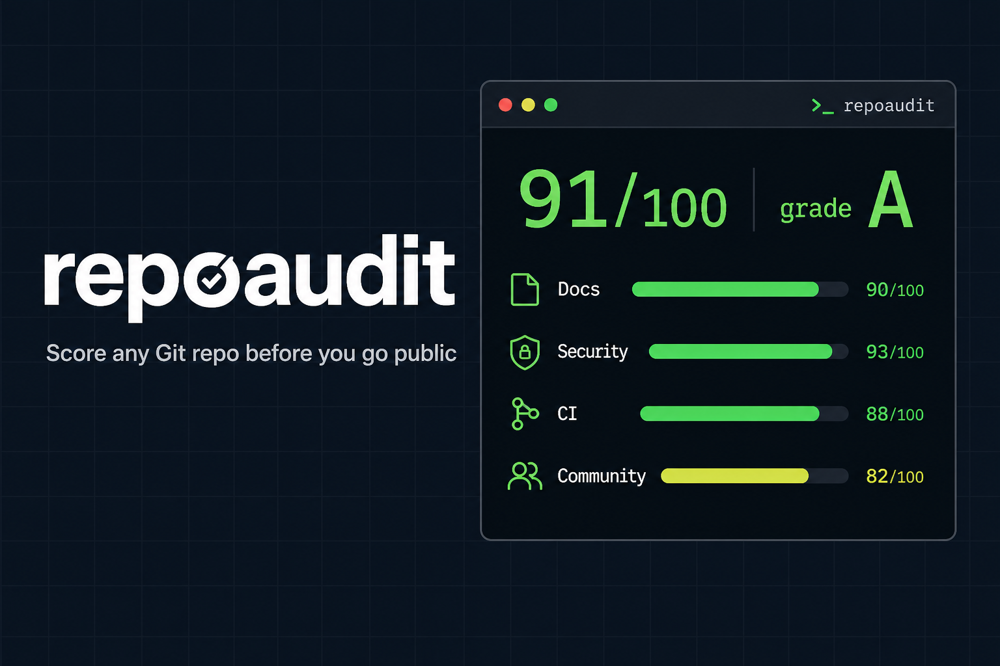

# repoaudit

**Score any Git repository for open-source readiness — then fix the gaps.**

[](https://github.com/Rezakarimzadeh98/repoaudit/actions/workflows/ci.yml)
[](https://github.com/Rezakarimzadeh98/repoaudit)
[](LICENSE)
[](package.json)
[](CONTRIBUTING.md)
[](https://github.com/Rezakarimzadeh98/repoaudit/issues?q=is%3Aissue+is%3Aopen+label%3A%22good+first+issue%22)

<p align="center">
  
</p>

Publishing a repo is easy. Making it look trustworthy is not.

`repoaudit` gives you a **0–100 readiness score**, a letter grade, and actionable findings across docs, license, security, CI, packaging, and community hygiene. Use it before you go public, in PR checks, or when reviewing someone else's project.

### Live demo



```bash
repoaudit .          # score your repo
repoaudit fix .      # scaffold missing LICENSE/CI/SECURITY/templates
repoaudit badge .    # print a shields.io badge
```

## Why people use it

| Problem | What repoaudit does |
|--------|----------------------|
| Forgot LICENSE / README / CI | Surfaces hard failures before the first clone |
| Accidental `.env` or tokens | Scans common secret patterns and sensitive filenames |
| "Is this repo contribution-ready?" | Scores templates, CONTRIBUTING, Dependabot, lockfiles |
| Manual checklist every time | One command + optional auto-fix |

## Quick start

```bash
npm install -g github:Rezakarimzadeh98/repoaudit
repoaudit .
```

One-shot without global install:

```bash
npx --yes github:Rezakarimzadeh98/repoaudit
```

### Sample output

```text
repoaudit
path   ./my-project
score  91/100  grade A

Docs         100  ████████████████████
License      100  ████████████████████
Security      92  ██████████████████░░
CI & Tests    88  █████████████████░░░
Packaging     90  ██████████████████░░
Community     85  █████████████████░░░

========================================================
[PASS] README
       Found README.md.
[WARN] Dependency updates
       No Dependabot/Renovate config found.
       hint: Automating dependency updates reduces security debt.
========================================================
Summary: 18 pass · 1 warn · 0 fail · 3 info
Ship-ready. This repo looks public-friendly.
Tip: run `repoaudit fix .` to scaffold missing hygiene files.
```

## Commands

```bash
# score the current repo
repoaudit

# score another path
repoaudit ./services/api

# markdown report (perfect for PR bodies / Actions job summaries)
repoaudit . --md

# JSON for scripts and bots
repoaudit . --json

# treat warnings as failures (CI gate)
repoaudit . --strict

# scaffold missing hygiene files (LICENSE, CI, SECURITY, templates, ...)
repoaudit fix .

# print a shields.io badge for your current score
repoaudit badge .
```

## Configuration (`.repoauditrc.json`)

If present in the repository root, `repoaudit` will apply optional config overrides:

- `disabledChecks: string[]` — disable specific checks by `id`
- `weights: Record<string, number>` — override scoring weight for specific checks
- `strictCategories: ("docs"|"license"|"security"|"ci"|"packaging"|"community")[]` — promote warnings in those categories to failures

Example:

```json
{
  "disabledChecks": ["community.funding"],
  "weights": {
    "security.secret_patterns": 4,
    "docs.readme": 2
  },
  "strictCategories": ["security"]
}
```

Invalid config fails fast with a clear error message.

### Auto-fix scaffolds

`repoaudit fix` only creates **missing** files — it never overwrites:

- `LICENSE` (MIT starter)
- `.gitignore`
- `SECURITY.md`, `CONTRIBUTING.md`, `CODE_OF_CONDUCT.md`, `CHANGELOG.md`
- Issue + PR templates
- GitHub Actions CI workflow
- Dependabot config

## GitHub Action

Drop this into any repo:

```yaml
name: repoaudit
on: [push, pull_request]
jobs:
  score:
    runs-on: ubuntu-latest
    steps:
      - uses: actions/checkout@v4
      - uses: Rezakarimzadeh98/repoaudit@v2
        with:
          path: .
          strict: "false"
          markdown: "true"
```

> Prefer `@v2` (or a full release tag) over `@main` so consumers stay on a stable Action release.

The Action writes a markdown report into the job summary and fails the job on FAIL findings.

## What it checks

| Category | Examples |
|----------|----------|
| **Docs** | README quality, install/usage, demos, badges |
| **License** | LICENSE detection (MIT, Apache-2.0, GPL-3.0, BSD-3-Clause) |
| **Security** | `.env` / credential files, secret-like patterns, `.gitignore`, SECURITY.md, Dependabot |
| **CI & Tests** | GitHub Actions / other CI, test files, `npm test` / lint scripts |
| **Packaging** | description, license field, keywords, repository URL, lockfile, containers |
| **Community** | CONTRIBUTING, Code of Conduct, changelog, issue/PR templates, funding |

Exit codes:

| Code | Meaning |
|-----:|---------|
| 0 | No failures (warnings allowed unless `--strict`) |
| 1 | One or more failures (or warnings in strict mode) |
| 2 | Unexpected runtime error |

## Use cases

1. **Pre-publish gate** — run before making a private project public  
2. **PR quality bot** — fail CI when someone removes LICENSE/tests or commits `.env`  
3. **Open-source review** — clone a dependency and get a readiness snapshot in seconds  
4. **Portfolio polish** — raise your own repos from “code dump” to “cloneable product”

## Share / launch kit

Ready-to-post copy for X, Reddit, Dev.to, and Show HN:

- [`docs/SHARE.md`](docs/SHARE.md)

If this saved you from publishing a half-ready repo, a star helps others find it.

## Contribute

Want to make this sharper? Start here:

- Open issues labeled [**good first issue**](https://github.com/Rezakarimzadeh98/repoaudit/issues?q=is%3Aissue+is%3Aopen+label%3A%22good+first+issue%22)
- Read [CONTRIBUTING.md](CONTRIBUTING.md)
- Easy wins: new checks, fewer false positives, Python/Go packaging, config file support

Every check is intentionally small — one focused PR can land in a single sitting.

## Development

```bash
git clone https://github.com/Rezakarimzadeh98/repoaudit.git
cd repoaudit
npm install
npm test
npm run build
node bin/repoaudit.js .
```

## License

MIT © [Reza Karimzadeh](https://github.com/Rezakarimzadeh98)
